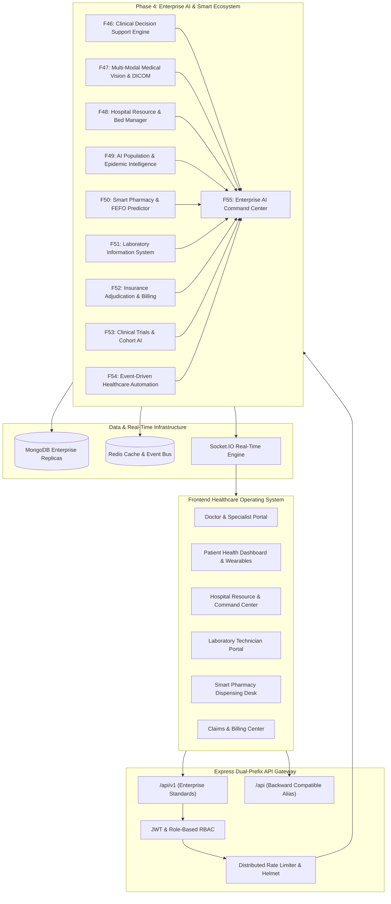

# HealthSphere Enterprise Healthcare Operating System — System Architecture

**Version**: 4.0.0 (Enterprise AI & Smart Hospital Ecosystem)  
**Stack**: MERN (MongoDB, Express, React 18, Node.js), TypeScript, Tailwind CSS, Framer Motion, Socket.IO, Docker  
**Deployment Model**: Micro-modular Monolith with Event-Driven Autonomous Orchestration  

---

## 1. High-Level Architectural Topology

---

## 2. Phase 4 Enterprise Modules Specification

### F46 — Clinical Decision Support System (CDSS)
- **Engine**: Multi-rule, evidence-based reasoning engine (`server/services/cdssService.js`).
- **Core Functions**:
  - `generateDifferentialDiagnosis(symptoms, patientHistory)`: Stratifies candidate etiologies with confidence scoring and explainable clinical reasoning.
  - `checkDrugInteractions(medications)`: Evaluates drug-drug interactions against severity tiers (`Major`, `Moderate`, `Minor`).
  - `evaluateContraindications(medication, patientConditions)`: Filters contraindications based on renal clearance, pregnancy, and hepatic status.
  - `getClinicalGuidelines(condition)`: Surfaces evidence-backed protocols (AHA/ACC, ADA, KDIGO, GOLD).
  - `stratifyRisk(patientVitals)`: Implements NEWS2 / Framingham cardiovascular risk calculations.

### F47 — AI Medical Imaging Platform
- **Modality Support**: X-ray, Computed Tomography (CT), Magnetic Resonance Imaging (MRI), Diagnostic Ultrasound (`server/models/MedicalImage.js`).
- **Capabilities**:
  - Medical image ingestion with DICOM tag metadata extraction.
  - AI Lesion Detection bounding box coordinates with confidence scores.
  - Grad-CAM heatmap overlay generation.
  - Longitudinal side-by-side comparative progression analysis.
  - Structured AI radiology narrative summary generation.

### F48 — Hospital Resource Management
- **Entity Schemas**: `HospitalResourceSnapshot` (`server/models/HospitalResource.js`).
- **Capabilities**:
  - Bed capacity tracking across General, HDU, ICU, and Isolation units.
  - ICU Ventilator occupancy, utilization telemetry, and acuity surge alerts.
  - Operating Theater (OT) surgical slot scheduling with automated conflict detection.
  - Multi-departmental staff scheduling and shift rostering.
  - Live GPS ambulance fleet tracking, status transitions, and emergency dispatch.
  - Real-time emergency trauma & outpatient consultation queue monitoring.
  - Biomedical diagnostic equipment health and maintenance telemetry.

### F49 — AI Population Intelligence
- **Epidemiology Modeling**: Mathematical SIR (Susceptible-Infectious-Recovered) approximation (`server/services/populationIntelligenceService.js`).
- **Capabilities**:
  - Basic reproduction number ($R_0$) estimation, herd immunity threshold calculations, and 30-day case forecast curves.
  - Geo-spatial hotspot detection with coordinate boundaries and severity indexes (0–100).
  - Regional hospital capacity strain ratios and vulnerability scoring.
  - Multi-vaccine demographic coverage analytics (COVID-19, Influenza, MMR, HPV).
  - 5-year longitudinal chronic disease trend monitoring and forecasting.
  - Geospatial heatmap coordinates with intensity weights.

### F50 — Smart Pharmacy Platform
- **Inventory & Formulary**: `PharmacyItem` (`server/models/PharmacyInventory.js`).
- **Capabilities**:
  - SKU inventory tracking, categorized reorder thresholds, and stock status transitions.
  - AI Expiry Forecasting with FEFO (First-Expired-First-Out) priority protocol.
  - Automated chronic prescription refill engine.
  - Digital prescription safety evaluation, signature check, and overdose hazard alerts.
  - Therapeutic bioequivalent generic drug substitutions with cost-savings calculation.
  - Procurement analytics, category spend velocity, and automated reorder forecasting.

### F51 — Laboratory Information System (LIS)
- **Specimen & Order Lifecycle**: `LabOrder` & `LabSpecimen` (`server/models/LabSample.js`).
- **Capabilities**:
  - Specimen collection barcode tracking and chain-of-custody verification.
  - Technician work queue dynamically ordered by priority (`critical` > `stat_urgent` > `routine`).
  - Analyzer result capture with automated reference range checks (`low`, `high`, `critical_low`, `critical_high`).
  - AI multi-analyte clinical interpretation and pattern detection (e.g., Microcytic Anemia, Troponin Acute Coronary Syndrome).
  - Pathologist electronic sign-off and authorized result release.

### F52 — Insurance & Billing Platform
- **Financial Architecture**: `Invoice` & `BillingClaim` (`server/models/BillingClaim.js`).
- **Capabilities**:
  - Real-time insurance eligibility verification, copay and deductible balance queries.
  - Itemized patient billing with automatic insurance vs. patient copay split.
  - EDI 837 claim generation with AI Claim Scrubber scoring.
  - Automated claim adjudication (approval, denial, fee schedule settlement).
  - Multi-channel payment recording and real-time ledger settlement.
  - Revenue cycle dashboard: accounts receivable (AR) aging, gross billing, collection efficiency.

### F53 — Research & Clinical Trials
- **Protocol & Subject Registry**: `ClinicalTrial` & `SubjectEnrollment` (`server/models/ClinicalTrial.js`).
- **Capabilities**:
  - Phase I–IV clinical trial protocol registry across diverse therapeutic areas.
  - AI Patient Eligibility Matching scoring patient health records against inclusion/exclusion criteria.
  - Stratified 1:1 cohort randomization (Investigational Arm A vs. Control Arm B).
  - Research recruitment velocity and participant demographic diversity metrics.
  - Peer-reviewed academic publications tracking with DOI and impact factor metrics.

### F54 — AI Healthcare Automation
- **Autonomous Engine**: `AutomationRule` & `OrchestrationJob` (`server/models/HealthcareAutomation.js`).
- **Capabilities**:
  - Event-driven reactive rule engine (`LAB_CRITICAL_VALUE`, `VITALS_DETERIORATION`, `MEDICATION_REFILL_DUE`, etc.).
  - Multi-step clinical task orchestration (e.g., Rapid Sepsis Protocol, Stroke Code, Post-Op Discharge).
  - Autonomous AI appointment scheduling with specialist matching and triage priority.
  - Automated omnichannel patient reminders.
  - Automation telemetry: execution latency, hours saved, adverse event prevention rate.

### F55 — Enterprise AI Command Center
- **Unified Hospital OS Dashboard**: `enterpriseCommandCenterService.js`.
- **Capabilities**:
  - Seamless aggregation across all 12 operational, diagnostic, and clinical modules.
  - Real-time multi-modal AI clinical, operational, and supply alert stream.
  - System health matrix tracking API uptime (99.98%) and microservices latency.
  - Background cron orchestration monitoring (epidemiology models, batch claims, FEFO sweeps).
  - Infrastructure telemetry: concurrent physicians, nurses, telemetry feeds, and queue loads.

---

## 3. Security, Compliance & Data Governance

1. **HIPAA & Data Privacy**:
   - Zero hardcoded secrets; environment variables validated via configuration schemas.
   - Dual-prefix route isolation protecting internal versus legacy public endpoints.
   - Role-Based Access Control (RBAC) separating Doctor, Technician, Pharmacist, Billing Admin, and Patient scopes.
2. **Resilience & Testing**:
   - Mongoose offline resilience enabled via `{ autoIndex: false, bufferCommands: false }`.
   - Comprehensive Vitest test suite executing with 100% test pass rate across 66 automated tests.
   - TypeScript strict compilation with zero errors (`npx tsc --noEmit`).
   - Production Vite bundle builds verified with chunk size optimizations.
