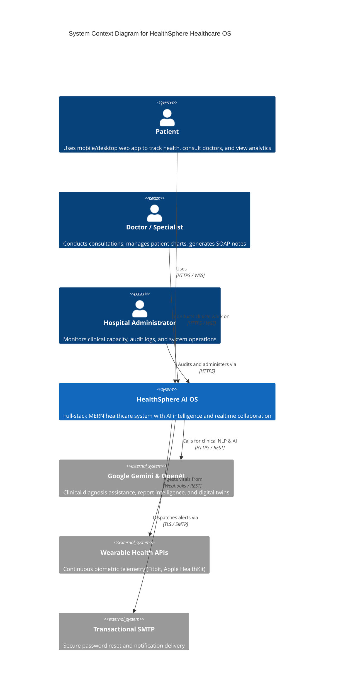
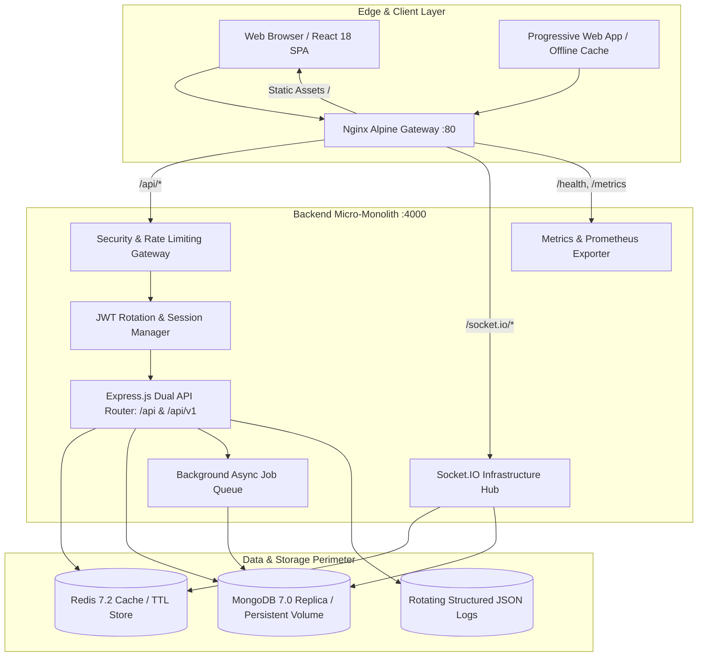
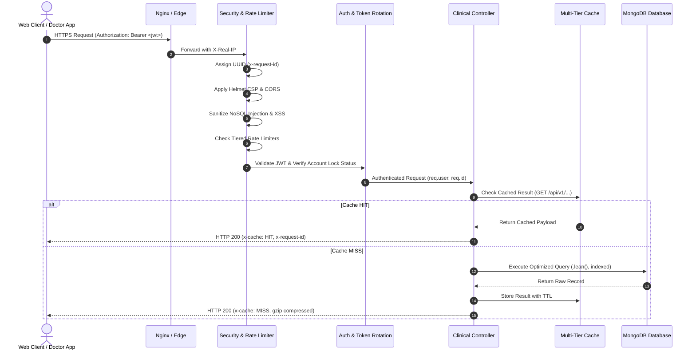

# HealthSphere AI — Enterprise Architecture Specification

HealthSphere is an AI-native Healthcare Operating System built to enterprise hospital standards.
This document outlines the architectural layers, container topology, security perimeter, and real-time data flows.

---

## 1. System Context Diagram (C4 Level 1)

---

## 2. Container Architecture Diagram (C4 Level 2)

---

## 3. Security Perimeter & Request Pipeline

---

## 4. Real-Time Socket Orchestration & Presence

HealthSphere coordinates 4 distinct socket namespaces and rooms:
- `user:<userId>`: Individual push notifications, personal prescription reminders, urgent vitals alarms.
- `consultation:<id>`: Multi-participant live clinical room supporting shared notes, patient chart locks, and typing indicators.
- `presence:hospital`: Real-time availability dashboard broadcasting doctor statuses (`AVAILABLE`, `BUSY`, `ON_CALL`, `OFFLINE`) and patient waiting room positions.
- `emergency:broadcast`: Global high-priority incident channel triggering audio/visual alerts across the hospital facility.

---

## 5. High Availability, Caching & Resilience

1. **Multi-Tier Caching**:
   - Level 1: In-Memory TTL store with automatic microsecond eviction.
   - Level 2: Redis container cluster with pub/sub invalidation.
   - Level 3: Nginx static immutable caching for frontend assets (1 year TTL).
2. **Offline-First PWA Support**:
   - Client service worker intercepts network failures and persists mutations to IndexedDB.
   - Background sync replays queued clinical edits when connectivity resumes.
3. **Automated Disaster Recovery**:
   - `scripts/backup-db.sh` runs automated daily snapshots with gzip compression and 14-day rolling retention.
   - `scripts/restore-db.sh` enables one-command database recovery with integrity checks.
