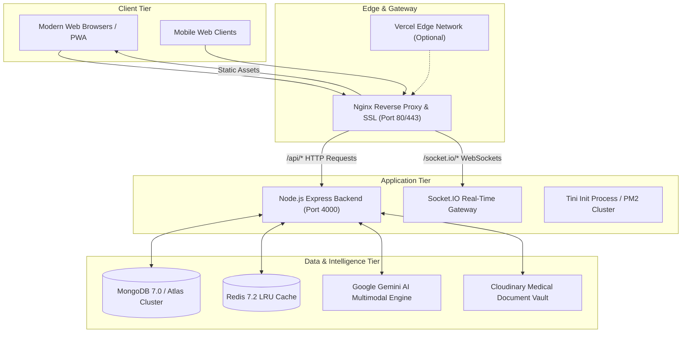

# HealthSphere Healthcare Operating System — Production Deployment Guide

This document provides complete, enterprise-grade deployment instructions for the **HealthSphere AI Healthcare Operating System** across containerized environments, cloud providers, and dedicated virtual machines.

---

## 1. System Architecture



---

## 2. Environment Configuration

HealthSphere enforces strict environment variable validation on boot via `server/config/envValidator.js`.

### Core Variables Template (`.env.docker`)

```ini
# Environment
NODE_ENV=production
PORT=4000
CLIENT_URL=https://healthsphere.yourdomain.com

# Authentication & Security
# Must be a cryptographically random string (min 32 characters)
JWT_SECRET=your_production_jwt_secret_min_32_characters_long_random_key
JWT_EXPIRES_IN=15m
REFRESH_TOKEN_EXPIRES_IN=7d

# Database & Cache
MONGODB_URI=mongodb+srv://<username>:<password>@cluster0.mongodb.net/healthsphere?retryWrites=true&w=majority&appName=HealthSphere
REDIS_URL=redis://redis:6379

# AI Services (Clinical Decision Support)
GEMINI_API_KEY=your_google_gemini_api_key
OPENAI_API_KEY=your_openai_api_key
AI_PROVIDER=gemini
AI_MODEL=gemini-flash-latest

# Medical Document Storage (HIPAA-Compliant Cloudinary Vault)
CLOUDINARY_CLOUD_NAME=your_cloud_name
CLOUDINARY_API_KEY=your_api_key
CLOUDINARY_API_SECRET=your_api_secret

# Frontend Build Arguments
VITE_API_URL=/api
VITE_SOCKET_URL=/
```

> [!CAUTION]
> **Zero Secrets Policy**: Never commit `.env`, private keys, or API tokens to source control. Use environment variable secret managers (GitHub Secrets, AWS Secrets Manager, Vercel Secrets, or Docker Secrets).

---

## 3. Docker Compose Production Deployment

The recommended production deployment runs the full container stack via Docker Compose:

### 3.1 Initial Setup
```bash
# 1. Clone repository
git clone https://github.com/Ashmita1206/HealthSphere.git
cd HealthSphere

# 2. Copy and configure production environment variables
cp .env.docker.example .env.docker
nano .env.docker

# 3. Build and launch containers
docker compose --env-file .env.docker up -d --build
```

### 3.2 Verify Container Health
```bash
# Check container statuses and health probes
docker compose ps

# Inspect backend logs
docker compose logs -f backend

# Run automated healthcheck probe
./scripts/healthcheck.sh
```

### 3.3 Container Overview
| Container Name | Base Image | Role | Port | Healthcheck |
| :--- | :--- | :--- | :--- | :--- |
| `healthsphere-frontend` | `nginx:1.27-alpine` | Web gateway, static asset host, reverse proxy | 80, 443 | `wget http://localhost:80/` |
| `healthsphere-backend` | `node:20-alpine` | API server, real-time sockets, AI orchestration | 4000 (internal) | `wget http://localhost:4000/api/healthcheck` |
| `healthsphere-mongodb` | `mongo:7.0` | Primary clinical document database | 27017 (internal) | `mongosh ping` |
| `healthsphere-redis` | `redis:7.2-alpine` | In-memory session store & query caching | 6379 (internal) | `redis-cli ping` |

---

## 4. Cloud Platform Deployment

### 4.1 Frontend on Vercel
1. Link your GitHub repository to Vercel.
2. The included [`vercel.json`](file:///d:/HEALTHSPHERE/HealthSphere/vercel.json) handles SPA routing, security headers, and static caching automatically.
3. Configure Environment Variables in Vercel Project Settings:
   - `VITE_API_URL`: `https://api.yourdomain.com/api`
   - `VITE_SOCKET_URL`: `https://api.yourdomain.com`
4. Deploy!

### 4.2 Backend on Render / AWS / DigitalOcean
1. **Render**: Use the provided [`render.yaml`](file:///d:/HEALTHSPHERE/HealthSphere/render.yaml) blueprint:
   ```yaml
   buildCommand: cd server && npm install --omit=dev
   startCommand: cd server && npm start
   healthCheckPath: /api/system/ready
   ```
2. **PM2 on VPS / Bare Metal**: Use [`ecosystem.config.cjs`](file:///d:/HEALTHSPHERE/HealthSphere/ecosystem.config.cjs):
   ```bash
   cd server
   npm ci --omit=dev
   pm2 start ../ecosystem.config.cjs --env production
   pm2 save
   pm2 startup
   ```

---

## 5. SSL / TLS Certificate Automation (Let's Encrypt)

To terminate SSL at the Nginx edge:
```bash
sudo apt install -y certbot python3-certbot-nginx
sudo certbot --nginx -d healthsphere.yourdomain.com
```

Certbot automatically configures HTTP-to-HTTPS redirects and schedules certificate renewal crons.

---

## 6. MongoDB Atlas Configuration

For enterprise deployments with multi-region high availability:

1. **Create Atlas Cluster**:
   - Provision an M10+ dedicated cluster in your target region.
   - Choose MongoDB 7.0+.
2. **Network Security**:
   - In **Network Access**, add your server/container egress IP addresses. Avoid `0.0.0.0/0` in production.
3. **Database User**:
   - Create a dedicated user with `readWrite` role on the `healthsphere` database.
4. **Connection String**:
   ```
   mongodb+srv://<username>:<password>@cluster0.abcde.mongodb.net/healthsphere?retryWrites=true&w=majority&appName=HealthSphere
   ```

---

## 7. Backup & Disaster Recovery Strategy

HealthSphere provides automated backup and restore utilities in the `scripts/` directory:

### 7.1 Automated Daily Backups
Configure a cron job to take daily automated dumps:
```bash
# Edit crontab
crontab -e

# Run daily backup at 02:00 UTC and retain for 14-30 days
0 2 * * * /path/to/HealthSphere/scripts/backup-db.sh >> /var/log/healthsphere_backup.log 2>&1
```

### 7.2 Restoring from Backup
```bash
# Restore specific archive with SHA256 integrity check
./scripts/restore-db.sh /var/backups/healthsphere/healthsphere_backup_20260911_020000.tar.gz
```

---

## 8. Zero-Downtime Rolling Update Workflow

```bash
cd /opt/healthsphere
git fetch origin main
git checkout main

# Rebuild images without bringing down live services
docker compose build backend frontend

# Restart services with minimal downtime
docker compose up -d --no-deps --build backend
docker compose up -d --no-deps --build frontend
```

---

## 9. Pre-Deployment & Post-Deployment Checklist

### Pre-Deployment
- [x] All unit and integration tests pass (`npm test`)
- [x] TypeScript validation completes with zero errors (`npx tsc --noEmit`)
- [x] Production bundle builds successfully (`npm run build`)
- [x] `JWT_SECRET` generated with 64 cryptographically secure random bytes
- [x] MongoDB Atlas connection string configured with SSL/TLS
- [x] CORS allowed origins configured with production domain (`CLIENT_URL`)
- [x] Content Security Policy configured in Helmet

### Post-Deployment
- [ ] Verify HTTP to HTTPS redirection
- [ ] Confirm `/health/liveness` and `/health/readiness` return `HTTP 200`
- [ ] Test user signup, login, and token refresh
- [ ] Verify WebSocket real-time connection in browser console
- [ ] Check structured logs in `/var/log/nginx/` or container logs
