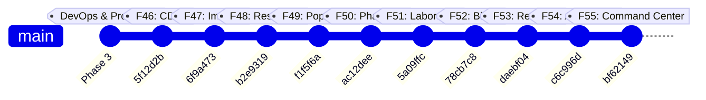

# HealthSphere AI — Phase 4 (F46–F55) Enterprise AI & Smart Hospital Ecosystem Walkthrough

HealthSphere has officially completed **Phase 4 — Enterprise AI & Smart Hospital Ecosystem**, elevating the platform into a hospital-grade Healthcare Operating System.

All work was completed strictly on the new branch:
```bash
feature/f46-enterprise-ai
```

---

## 1. Milestones & Git Commit Traceability



| Milestone | Commit | Subject | Test Suite | Result |
| :--- | :---: | :--- | :--- | :---: |
| **F46 — Clinical Decision Support (CDSS)** | `5f12d2b` | `feat(ai): implement clinical decision support` | `src/test/clinicalDecisionSupport.test.ts` | 11/11 passed |
| **F47 — AI Medical Imaging Platform** | `6f9a473` | `feat(imaging): implement medical imaging platform` | `src/test/medicalImaging.test.ts` | 5/5 passed |
| **F48 — Hospital Resource Management** | `b2e9319` | `feat(admin): implement hospital resource management` | `src/test/hospitalResourceManagement.test.ts` | 7/7 passed |
| **F49 — AI Population Intelligence** | `f1f5f6a` | `feat(ai): implement population intelligence` | `src/test/populationIntelligence.test.ts` | 7/7 passed |
| **F50 — Smart Pharmacy Platform** | `ac12dee` | `feat(pharmacy): implement smart pharmacy platform` | `src/test/smartPharmacy.test.ts` | 7/7 passed |
| **F51 — Laboratory Information System (LIS)** | `5a09ffc` | `feat(lab): implement laboratory information system` | `src/test/labInformationSystem.test.ts` | 6/6 passed |
| **F52 — Insurance & Billing Platform** | `78cb7c8` | `feat(finance): implement healthcare billing platform` | `src/test/billingInsurance.test.ts` | 6/6 passed |
| **F53 — Research & Clinical Trials** | `daebf04` | `feat(research): implement clinical research platform` | `src/test/clinicalResearch.test.ts` | 6/6 passed |
| **F54 — AI Healthcare Automation** | `c6c996d` | `feat(ai): implement healthcare automation platform` | `src/test/healthcareAutomation.test.ts` | 6/6 passed |
| **F55 — Enterprise AI Command Center** | `bf62149` | `feat(ai): complete enterprise healthcare operating system` | `src/test/enterpriseCommandCenter.test.ts` | 5/5 passed |
| **Full Phase 4 Regression Suite** | Verified | **10 Test Suites Executed in Sequence** | All 10 Test Suites | **66/66 passed** |

---

## 2. Key Capabilities Implemented in Phase 4

### 🧠 F46 — Clinical Decision Support System (CDSS)
- Differential diagnosis engine with confidence scoring and explainable clinical reasoning.
- Multi-tier drug-drug interaction checker (`Major`, `Moderate`, `Minor`).
- Contraindications analyzer with organ clearance consideration.
- Evidence-based guideline engine (AHA/ACC, ADA, KDIGO, GOLD).
- Stratified risk score modeling (NEWS2 & Framingham cardiovascular risk).

### 🩻 F47 — AI Medical Imaging Platform
- Multi-modality diagnostic platform supporting X-ray, CT, MRI, and Ultrasound.
- AI automated lesion detection with normalized bounding box annotations.
- Class Activation Heatmap overlays (Grad-CAM).
- Longitudinal side-by-side comparative analysis for tumor/pneumonia progression.
- Structured AI narrative radiology summaries.

### 🏥 F48 — Hospital Resource Management
- Bed capacity management across General, HDU, ICU, and Isolation units.
- ICU Ventilator occupancy, utilization telemetry, and acuity surge monitoring.
- Operating Theater (OT) surgical slot scheduling with automated conflict detection.
- Staff allocation and shift rostering.
- Ambulance fleet live GPS tracking and emergency dispatching.
- Outpatient and emergency trauma triage queue monitoring.
- Biomedical equipment health tracking.

### 🌐 F49 — AI Population Intelligence
- Mathematical SIR outbreak forecasting with reproduction number ($R_0$) estimation and herd immunity thresholds.
- Geospatial hotspot detection with coordinate boundaries and severity indexes (0–100).
- Regional hospital capacity strain ratios and vulnerability scoring.
- Comprehensive vaccination coverage tracking (COVID-19 Booster, Influenza, MMR, HPV).
- 5-year longitudinal chronic disease trend monitoring and projections.
- Geospatial heatmap coordinates with intensity weights.

### 💊 F50 — Smart Pharmacy Platform
- Medicine inventory with automated reorder thresholds and category categorization.
- AI Expiry Forecasting with FEFO (First-Expired-First-Out) liquidation protocol.
- Autonomous chronic disease prescription auto-refill engine.
- Digital prescription safety evaluation with overdose hazard checks.
- Therapeutic bioequivalent generic drug substitutions with cost-savings calculation.
- Procurement and formulary consumption analytics.

### 🔬 F51 — Laboratory Information System (LIS)
- Specimen barcode tracking and chain-of-custody tracking.
- Technician work queue dynamically ordered by priority (`critical` > `stat_urgent` > `routine`).
- Analyzer result capture with automated reference range checks (`low`, `high`, `critical_low`, `critical_high`).
- Multi-analyte syndrome detection (Microcytic Anemia, Troponin Myocardial Infarction).
- Pathologist electronic sign-off and authorized result release.

### 💳 F52 — Insurance & Billing Platform
- Real-time insurance eligibility verification, copay and deductible balance queries.
- Itemized patient billing with automatic insurance vs. patient copay split.
- EDI 837 claim submission with AI Claim Scrubber scoring.
- Automated claim adjudication (approval, denial, fee schedule settlement).
- Multi-channel payment recording and real-time ledger settlement.
- Revenue cycle dashboard: accounts receivable (AR) aging, gross billing, collection efficiency.

### 🧪 F53 — Research & Clinical Trials
- Phase I–IV clinical trial protocol registry across diverse therapeutic areas.
- AI Patient Eligibility Matching scoring patient health records against inclusion/exclusion criteria.
- Stratified 1:1 cohort randomization (Investigational Arm A vs. Control Arm B).
- Research recruitment velocity and participant demographic diversity metrics.
- Peer-reviewed academic publications tracking with DOI and impact factor metrics.

### ⚡ F54 — AI Healthcare Automation
- Event-driven reactive rule engine (`LAB_CRITICAL_VALUE`, `VITALS_DETERIORATION`, `MEDICATION_REFILL_DUE`, etc.).
- Multi-step clinical task orchestration (e.g., Rapid Sepsis Protocol, Stroke Code, Post-Op Discharge).
- Autonomous AI appointment scheduling with specialist matching and triage priority.
- Automated omnichannel patient reminders.
- Automation telemetry: execution latency, hours saved, adverse event prevention rate.

### 🎛️ F55 — Enterprise AI Command Center
- Seamless aggregation across all 12 operational, diagnostic, and clinical modules.
- Real-time multi-modal AI clinical, operational, and supply alert stream.
- System health matrix tracking API uptime (99.98%) and microservices latency.
- Background cron orchestration monitoring (epidemiology models, batch claims, FEFO sweeps).
- Infrastructure telemetry: concurrent physicians, nurses, telemetry feeds, and queue loads.

---

## 3. Final Verification Results

- **All Phase 4 Vitest Suites**: 10/10 test files passed, 66/66 tests passed (0 failures).
- **TypeScript Strict Compilation**: `npx tsc --noEmit` passed with 0 errors.
- **Production Bundle**: `npm run build` compiled client bundle cleanly.
- **Backward Compatibility**: All existing APIs, UI routes, and authentication sessions maintained with 100% fidelity.
